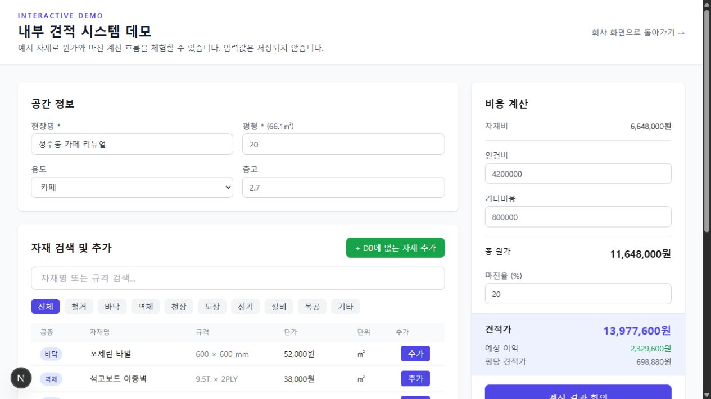

# ALVB Web

상업공간 인테리어 회사에서 사용하기 위해 개발한 고객용 웹사이트와 내부 견적 관리 도구입니다.

[배포 화면](https://alvb-web.vercel.app) · [견적 시스템 데모](https://alvb-web.vercel.app/estimate-demo) · [API 문서](https://alvb-web.vercel.app/api-docs)

## 주요 기능

- 회사 소개와 업종별 공간 레퍼런스
- 고객 견적 요청 접수와 개인정보를 제외한 공개 사례 조회
- 자재 검색·관리와 평수·층고 기반 수량 계산
- 자재비, 인건비, 기타 비용, 마진율을 반영한 견적 산출
- 직원 인증과 견적 저장·이력 조회
- Supabase RLS를 이용한 공개 데이터와 내부 데이터 분리

로그인이 필요한 내부 견적 화면은 동일한 계산 컴포넌트를 사용하는 [공개 데모](https://alvb-web.vercel.app/estimate-demo)에서 확인할 수 있습니다. 데모 데이터는 브라우저에서만 동작하며 저장되지 않습니다.



## 처리 흐름

```text
공간 레퍼런스 확인 → 온라인 견적 요청
                          ↓
직원 로그인 → 자재 선택 → 원가·마진 계산 → 견적 저장
```

## 기술 스택

- Next.js 16, React 18, TypeScript
- Tailwind CSS
- Supabase Auth, PostgreSQL, RLS
- Next.js Route Handlers
- OpenAPI, Swagger UI
- Node.js Test Runner

## 구현 메모

### 견적 계산의 신뢰 경계

클라이언트가 전달한 자재 소계를 그대로 저장하지 않습니다. API에서 단가와 수량을 검증한 뒤 자재비, 총원가, 견적가를 다시 계산합니다. 평수와 층고를 사용하는 자재 계산식은 `eval` 대신 숫자, 사칙연산, 괄호, `p`, `h`만 허용하는 파서로 처리합니다.

### 공개 데이터 분리

고객 원본에는 이름, 연락처, 희망 일정, 요청사항이 포함됩니다. 공개 사례는 `public_quotes` 뷰를 통해 업종, 공사 범위, 면적, 예산, 지역만 반환합니다. 내부 API는 Supabase 세션을 별도로 검증하고 데이터베이스의 RLS 정책을 적용합니다.

## 프로젝트 구조

```text
app/
├── api/                 # 견적·자재 API
├── estimate/            # 인증이 필요한 내부 견적 시스템
├── estimate-demo/       # 저장하지 않는 공개 체험 화면
├── portfolio/           # 업종별 공간 레퍼런스
└── quote/               # 고객 견적 요청
components/estimate/     # 견적 화면 컴포넌트
lib/estimate/            # 계산, 수식 파서, 입력 검증
backend/                 # Supabase 스키마와 RLS 정책
tests/                   # 견적 계산·검증 테스트
```

## 로컬 실행

```powershell
npm install
Copy-Item .env.local.example .env.local
npm run dev
```

`.env.local`에 Supabase 프로젝트 값을 입력합니다.

```env
NEXT_PUBLIC_SUPABASE_URL=https://your-project-id.supabase.co
NEXT_PUBLIC_SUPABASE_ANON_KEY=your-anon-key
```

새 Supabase 프로젝트에서는 `backend/supabase_setup.sql`, `backend/estimate_setup.sql`을 순서대로 적용합니다.

## 검증

```bash
npm run check
```

테스트는 금액 재계산, 수량 변경, 허용된 자재 수식, 조작된 소계 교정, 잘못된 입력 거부를 확인합니다.

## 상태

정식 출시 전 회사가 폐업해 운영 단계까지 이어지지는 않았습니다. 현재 저장소의 인명, 연락처, 견적, 공간 이미지, 실적 수치와 후기는 화면 확인을 위한 예시 데이터입니다.

별도 오픈소스 라이선스를 부여하지 않습니다.
